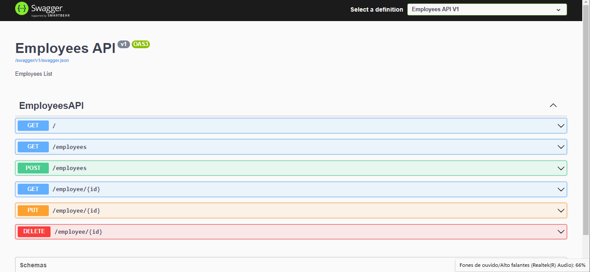

# Employees API
A Restful API for CRUD operations simulating an Employees Database.

## Contents
- [Overview](#overview)
    - [The Challenge](#the-challenge)
    - [Images](#images)
    - [Links](#links)
    - [Built with](#built-with)
    - [Learnings](#learnings)

## Overview

### The Challenge

The Employees API was built to practice and improve my skills in .NET/ASP.NET CORE WEBAPI's, ENTITY FRAMEWORK, SQLSERVER, RESTful API's, tests, deploy on Azure cloud and API documentation.

__Users should able to?__
- Create an Employee.
- List all employees or a specific employee.
- Update an employee name, undername and role.
- Remove an employee from Database.

### Images

<small>API Docs</small>

### Links

- URL to API Docs deployed to Azure Cloud: https://employeesapi.azurewebsites.net/swagger/index.html

### Built with

- ASP.NET CORE 6.0
- ENTITY FRAMEWORK
- SQLSERVER
- Azure WebSites
